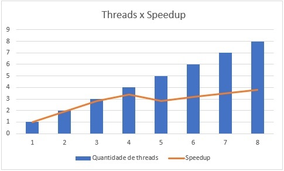

Discente: Maurício Vielmo Schmaedeck
Disciplina: Programação Paralela (ELC139)

## Questões pthreads

### Questão 1)

**Particionamento:** O particionamento consiste em dividir o problema em pequenas tarefas. No caso desse programa, trata-se de um particionamento **de dados**, visto que os dados são divididos entre as unidades de trabalho. Isso pode ser exemplificado no trecho de código abaixo, onde cada thread passa a operar em um intervalo (`start` ~ `end`) do vetor.

``` c
long offset = (long) arg; // offset da thread atual
[...]     
int wsize = dotdata.wsize; // tamanho do intervalo de cada thread
int start = offset*wsize;
int end = start + wsize;
```

**Comunicação:** Consiste na determinação das estruturas e algoritmos necessários para que as threads se comuniquem de forma correta (evitando, por exemplo, condições de corrida). Isso pode ser visto no seguinte trecho, onde é realizado um lock na entrada da região crítica.

``` c
pthread_mutex_lock (&mutexsum);
dotdata.c += mysum;
pthread_mutex_unlock (&mutexsum); 
```

**Aglomeração:** Visa evitar o excesso de comunicação através da união de diversas tarefas em uma única grande tarefa. Isso pode ser exemplificado no seguinte trecho, onde cada thread mantém uma variável exclusiva para acumular o valor da sua soma, antes de enviar a soma para a região compartilhada:

``` c
for (i = start; i < end ; i++)  {
    mysum += (a[i] * b[i]);
}
```

**Mapeamento:** Consiste na preparação para distribuição das tarefas entre os trabalhadores. Isso pode ser exemplificado no trecho abaixo, onde a quantidade de trabalho é ajustada de acordo com a quantidade de trabalhadores, e depois copiada para uma estrutura compartilhada entre todos.

``` c
nthreads = atoi(argv[1]); 
wsize = atoi(argv[2]);  // worksize = tamanho do vetor de cada thread
...
dotdata.wsize = wsize;
```

### Questão 2)

| Threads  | Elementos | Repetições | Tempo médio 10 exec. (usec) | Speedup* |
| -------- | --------- | ---------- | --------------------------- | -------- |
| 1        | 1000000   | 2000       | 6.082.813,6                 | 1x       |
| 2        | 500000    | 2000       | 3.049.112,0                 | 1.9x     |
| 3        | 333333,3  | 2000       | 2.142.774,3                 | 2.8x     |
| 4        | 250000    | 2000       | 1.745.861,8                 | 3.4x     |
| 5        | 200000    | 2000       | 2.140.297,6                 | 2.8x     |
| 6        | 166666,6  | 2000       | 1.879.064,6                 | 3.2x     |
| 7        | 142857,1  | 2000       | 1.711.459,4                 | 3.5x     |
| 8        | 125000    | 2000       | 1.567.483,4                 | 3.8x     |

*Em relação ao valor o valor obtido quando executado com uma thread

### Questão 3)

O speedup se sustenta enquanto a quantidade de threads disponibilizada ao programa é menor que a quantidade de threads do computador (4). Após esse ponto, ainda nota-se speedup, contudo, ele torna-se mais incosistente, uma vez que depende muito mais do algoritmo de escalonamento.

### Questão 4)



### Questão 5)

A diferença entre um programa e outro é que a segunda versão não possui o `lock` usado na entrada da região crítica. Isso faz com que a segunda versão do programa fique **errada**, visto que a leitura e escrita da variável não é atômica. Dessa forma, o valor escrito por uma thread pode ser ignorado (nos casos onde as duas threads leem o mesmo valor da memória e incrementam esse mesmo valor com a sua soma) ou, em casos mais raros, pode ocorrer uma corrpução total do valor armazenado [1].

## Questões OpenMP

| Threads  | Elementos | Repetições | Tempo médio 10 exec. (usec) | Speedup* |
| -------- | --------- | ---------- | --------------------------- | -------- |
| 1        | 1000000   | 2000       | 5.900.562,9                 | 1x       |
| 2        | 500000    | 2000       | 2.967.399,3                 | 1.9x     |
| 3        | 333333,3  | 2000       | 1.974.843,0                 | 2.9x     |
| 4        | 250000    | 2000       | 1.673.098,6                 | 3.5x     |
| 5        | 200000    | 2000       | 2.113.829,5                 | 2.7x     |
| 6        | 166666,6  | 2000       | 1.801.921,1                 | 3.2x     |
| 7        | 142857,1  | 2000       | 1.689.122,9                 | 3.4x     |
| 8        | 125000    | 2000       | 1.596.851,6                 | 3.6x     |

*Em relação ao valor o valor obtido quando executado com uma thread

## Referências

* [1] [Data Race](https://en.wikipedia.org/wiki/Race_condition#Data_race)
* Adam Pritchard, [Markdown Cheatsheet](https://github.com/adam-p/markdown-here/wiki/Markdown-Cheatsheet)